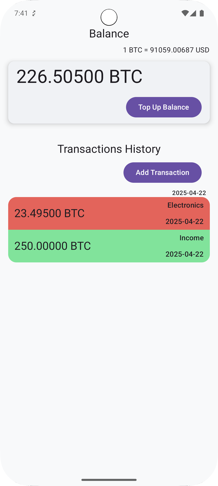
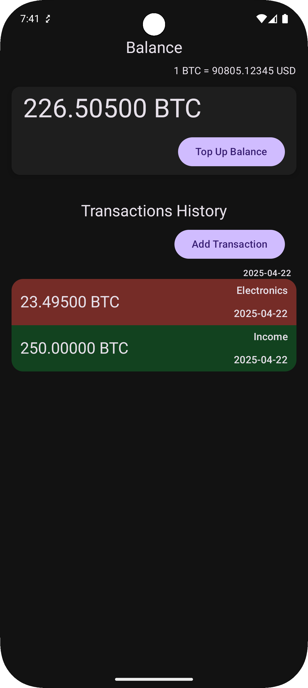

## ✨ Features

- ✉️ **View and manage balance** with live updates
- 🌍 **Bitcoin to USD exchange rate** display, updated once per session or once per hour
- 📋 **Transactions history** with:
  - Income / Outcome categorization
  - Lazy paging with grouping by date
- ➕ **Top-up balance** with validation (value > 0, max 100,000, ≤ 5 decimals, ≤ current balance)
- ⚡ **Reactive architecture** using `StateFlow` and `PagingData`

---

## 🖼️ Screenshots

  
  

---

## 🚀 Tech Stack

| Layer            | Libraries / Tools                                     |
|------------------|-------------------------------------------------------|
| UI               | Jetpack Compose, Material3, StateFlow                 |
| DI               | Hilt                                                  |
| Architecture     | MVVM + UseCase-based domain                           |
| Persistence      | Room                                                  |
| Networking       | Ktor Client                                           |
| Tests            | MockK, Turbine, Coroutines Test, kotlin.test          |

---

### Dependencies
All libraries use **Version Catalog** (`libs.versions.toml`):

---

## ⚖️ Testing

Tests for `BalanceViewModel` include:
- Initial state and flow emissions
- Top-up dialog visibility
- Input validation
- Error message handling

---

## 🚫 Limitations & Improvements

- I want to separate i by features (balance/transaction), but they are coupled and related to one big feteature, so there is no sense in this separation
- Tests covered only on VM. Even inside this VM coverege could be beter. The issue is the lack of time

---
